# @indoor-analytics/multi-path

Computes average path segments from an ensemble of paths.

## How to use

Add this line to `~/.npmrc` to set up the package registry:
```shell
@indoor-analytics:registry=https://npm.pkg.github.com/indoor-analytics
```

In your project, install the package:
```shell
npm i --save @indoor-analytics/multi-path
```

Import the function in your code:
```javascript
import {ClusteringTree} from "@indoor-analytics/multi-path";
```


# Algorithm formalization

```text
On définit une zone d’intérêt ZOI (Zone of Interest) comme par exemple une salle ou un bâtiment ou un étage.

On ajoute chaque trace individuelle dans la ZOI de la manière suivante.

POUR CHAQUE trace individuelle T dans le dataset D :
    INITIALISER la trace tronquée TT à vide
    POUR CHAQUE paire de points p(i) DANS la trace individuelle T :
        SI p(i) est en dehors de la ZOI ALORS
            SI p(i+1) est en dehors de la ZOI ALORS
                NE RIEN FAIRE
            SINON // p(i+1) est dans la ZOI ALORS
                CALCULER le point d’intersection pp du segment [p(i),p(i+1)] avec l’un des bords de la ZOI
                AJOUTER pp à la fin de TT
        SINON // SI p(i) est dans la ZOI
            SI p(i+1) est en dehors de la ZOI ALORS
                CALCULER le point d’intersection pp du segment [p(i),p(i+1)] avec l’un des bords de la ZOI
                AJOUTER pp à la fin de TT
            SINON // p(i+1) est dans la ZOI ALORS
                AJOUTER p(i) à la fin de TT
    SI TT n’est pas vide ALORS
        ASSOCIER TT à la ZOI

On alors une ZOI avec les traces tronquées. On fonctionne ensuite récursivement en découpant la ZOI en 4 sous-zones et en ajoutant chaque trace individuelle associé à la ZOI à chaque sous-zone (en appliquant de nouveau la procédure ci-dessus).

On répète l’approche jusqu’à une certaine profondeur D qui correspond au niveau de granularité qu’on souhaite obtenir pour le clustering.

À partir de maintenant, on a nos clusters de traces individuelle et on souhaite extraire le graphe de flux

En partant des plus petites ZOI (feuilles de l’arbre de ZOI).

POUR CHAQUE ZOI “feuille”:
    POUR CHAQUE côté c de la ZOI:
        CALCULER Le point moyen entrant pme(c) du côté à partir de tous les points d’intersections entrants dans la zone
        CALCULER Le point moyen sortant “pms(c)” du côté à partir de tous les points d’intersections sortants dans la zone
    POUR CHAQUE trajectoire tronquée
        INCREMENTER le tuple <pme(ce),pms(cs),N> pour les trajectoires tronquées qui rentrent par le côté ce et sortent par le côté cs
    RETOURNER l’ensemble des tuples calculés à la ZOI parente

POUR CHAQUE ZOI “intermédiaire”:
    RECUPER les tuples des ZOI filles
    AGRÉGER les 4 ensembles de tuples dans un seul
    RETOURNER l’ensemble global des tuples à la ZOI parente

Une fois à la ZOI racine, on a donc un ensemble de tuples  <pme(ce),pms(cs),N> qui sont des segments (SRC,DST) du graphe de flux où N donne la popularité du segment.
```

# Clustering example

By default, the library uses a square to encapsulate the original zone of interest; to increase the tree depth, it divides
each square into four area-equivalent squares.

In this example, we want a clustering tree with a depth of 6.

0) https://gist.github.com/Alystrasz/7ca319234d057c58f1b2eadb4b6f2e61

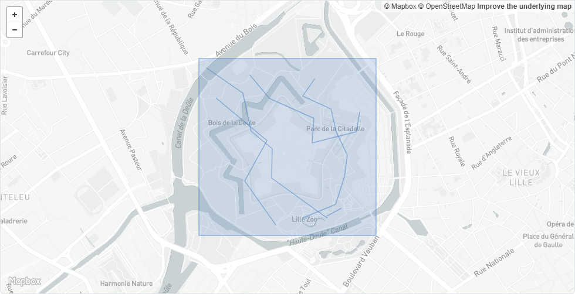

1) https://gist.github.com/Alystrasz/8b82cc7c58673d71a8931a430b98ff47

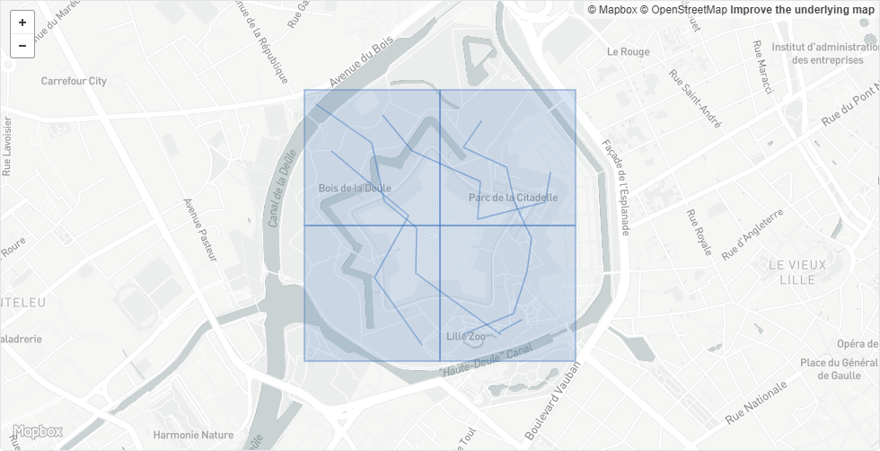

2) https://gist.github.com/Alystrasz/9f3f847e12e5d0139ca469705dba997c


3) https://gist.github.com/Alystrasz/e54b17bc9c1c34e8be0dd38362eb1fe4

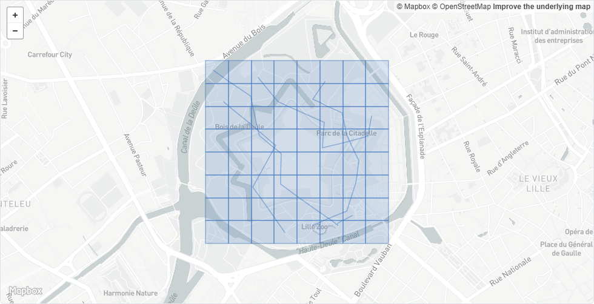

4) https://gist.github.com/Alystrasz/0e0108826fbbde131e2e8806c3a015d6

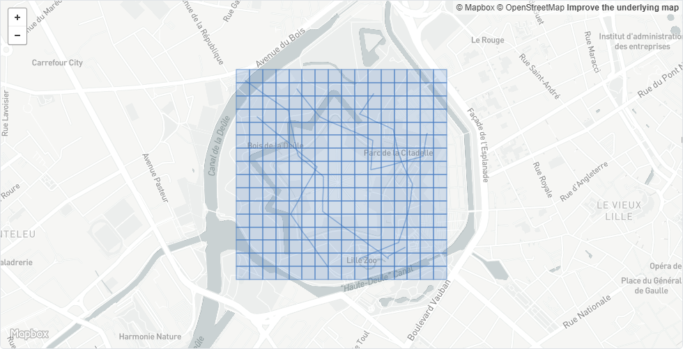

5) https://gist.github.com/Alystrasz/6337033708c5d768b08547c0a38c7012

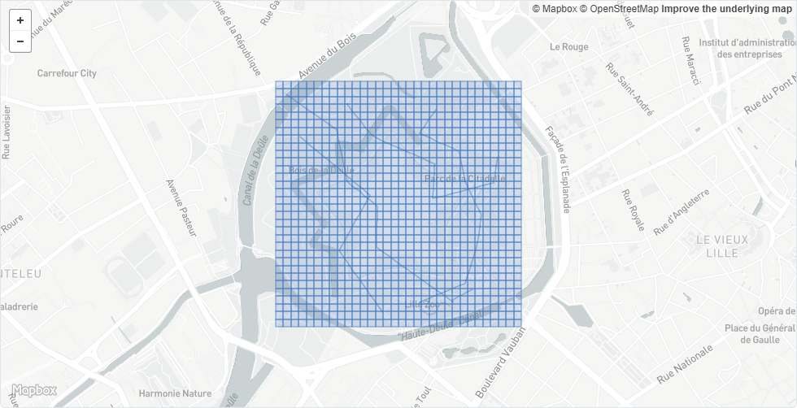

6) https://gist.github.com/Alystrasz/75c6320cbcf99bf73af6cf7f1c75ccab

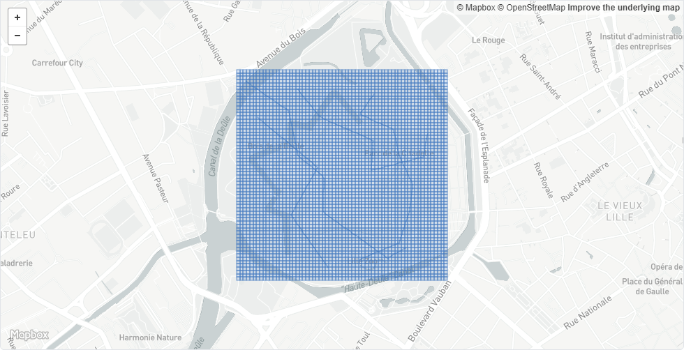


# Average path extraction example

Hosted on https://gist.github.com/Alystrasz/a9f647a75b99a4fc7b7f1f24510a38c5

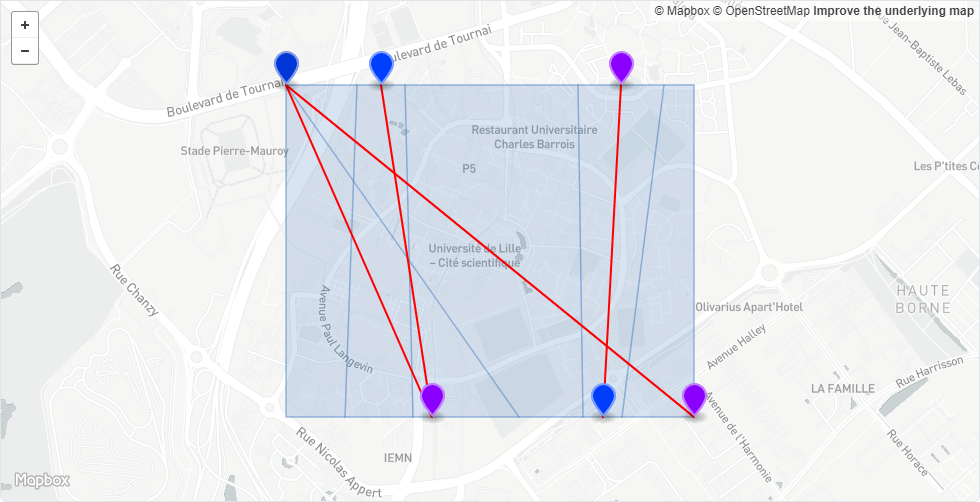

Input paths are featured in light blue, average entrance locations are marked in blue,
average exit locations are marked in purple.

6 paths are included in the zone; the algorithm extracts 4 average paths:
* path from top left vertex to bottom right vertex is extracted;
* to the bottom left, a location is the average exit location of 3 paths, and is the exit of 2 paths:
    * first one starting from top left vertex, but ending on bottom boundary;
    * second one starting from average entrance location on top boundary.
* path (to the right) from bottom boundary average entrance to top boundary average exit.

# Indoor analytics integration example

Here is an example of clustering on 7 paths.
You'll find below the images links to gists for each step.

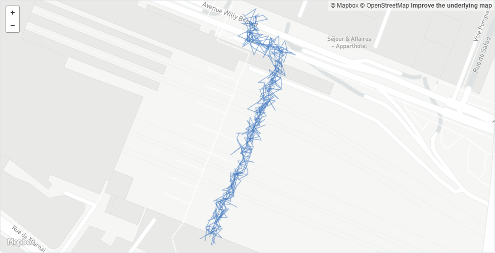
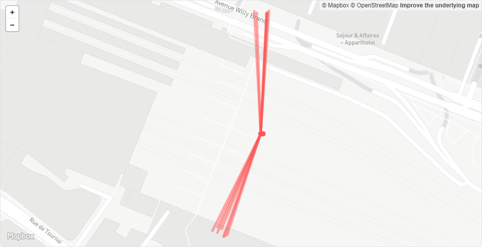
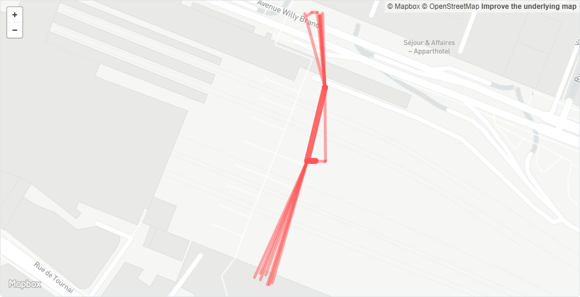
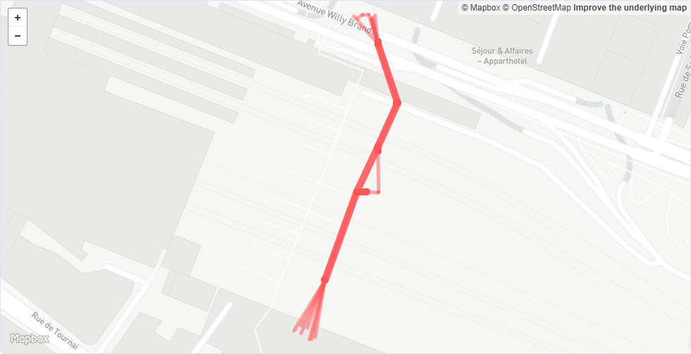
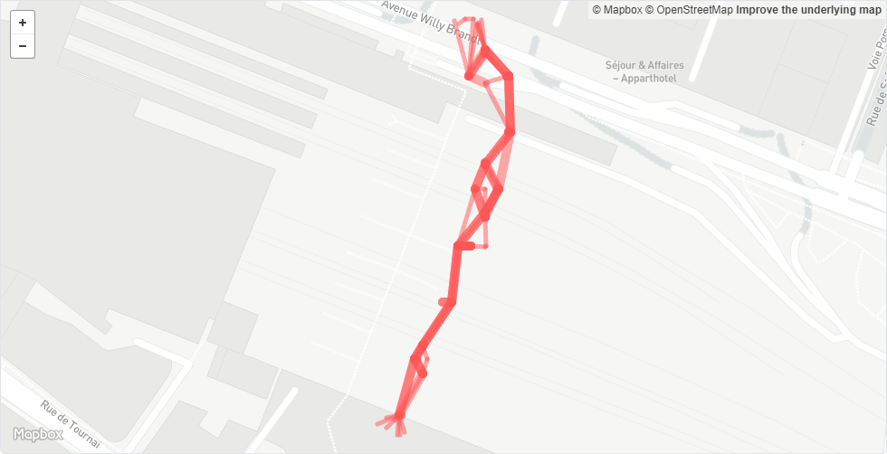
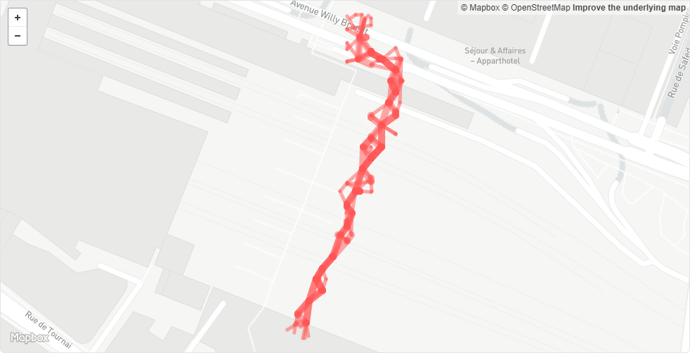
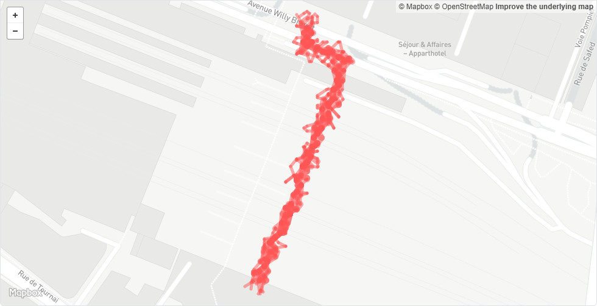

1. original paths: https://gist.github.com/Alystrasz/3869f10c03bca42ce6a228e6d91af291
2. depth 1: https://gist.github.com/Alystrasz/8c01eac2fa56e3a89a0f3d3c7172add3
3. depth 2: https://gist.github.com/Alystrasz/ee13ece0e1871205a0708c0ef4773c30
4. depth 3: https://gist.github.com/Alystrasz/93db5e8e8346ca5709f61126b6387ff6
5. depth 4: https://gist.github.com/Alystrasz/ff6066c583411808c8057e0be0e10a0d
6. depth 5: https://gist.github.com/Alystrasz/efd85a38dfe2af7aed1406ac0957b260
7. depth 6: https://gist.github.com/Alystrasz/9b99be7a7f6adb8ee27853e86a29ea0c
